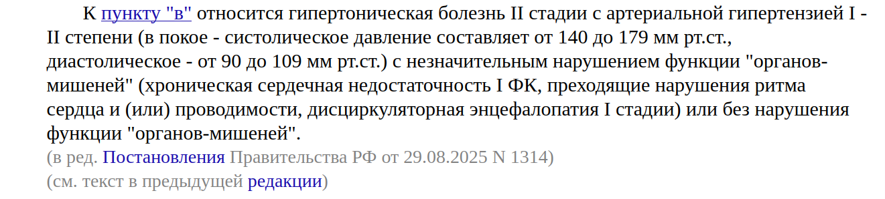

# Техническое задание на систему мониторинга

Документ описывает требования к системе мониторинга телеметрии. Текст
оформлен по правилам, описанным в `MARKDOWN_RULES.md`, и пригоден для
конвертации в `.docx` командой `docxmd .` из этой папки.

## Назначение

Система предназначена для сбора, хранения и визуализации телеметрии с
полевых устройств. Целевая среда эксплуатации — закрытый контур
предприятия, без доступа в публичные сети.

Ключевые задачи:

- сбор телеметрии по протоколу MQTT с периодом не реже одной секунды;
- хранение исторических данных глубиной до 2 лет;
- построение дашбордов с задержкой обновления не более 5 секунд;
- отправка алертов при выходе показателей за пороги.

## Архитектура

Система состоит из трёх логических слоёв.

1. Слой сбора: брокер MQTT и набор адаптеров протоколов.
2. Слой хранения: time-series база данных и колоночное хранилище для
   агрегатов.
3. Слой визуализации: веб-приложение и движок алертинга.



Каждый слой развёртывается независимо и может масштабироваться
горизонтально.

### Слой сбора

Брокер обязан соответствовать спецификации MQTT 5.0. Для каждого
типа устройства реализуется отдельный адаптер.

Таблица: Поддерживаемые источники телеметрии

| Тип устройства | Протокол  | Период опроса |
| -------------- | --------- | ------------- |
| Контроллер ПЛК | Modbus TCP| 1 с           |
| Датчик IIoT    | MQTT 5.0  | по событию    |
| Шкаф энергомет.| OPC UA    | 5 с           |

Сводные требования к адаптерам:

1. Все адаптеры реализуют единый интерфейс публикации.
   1. Метод `publish(topic, payload)` идемпотентен.
   2. Ошибки сети логируются и не приводят к потере очереди.
      1. Очередь персистентна между перезапусками процесса.
      2. Размер очереди ограничен сверху.
   3. Метрики Prometheus экспортируются на `/metrics`.
2. Конфигурация — YAML, валидируется при старте.
3. Перезапуск без потери накопленных метрик.

### Слой хранения

Данные хранятся в двух представлениях: сырые отсчёты в TSDB и
агрегаты 1m/1h/1d в колоночном хранилище.

> Согласно требованиям ИБ заказчика, прямой доступ к TSDB из контура
> визуализации запрещён. Все запросы выполняются через сервисный API.

## Пример конфигурации

Минимальная конфигурация адаптера MQTT приведена ниже.

```yaml
adapter:
  type: mqtt
  broker: tcp://broker.local:1883
  topics:
    - sensors/+/temperature
    - sensors/+/pressure
  qos: 1
```

Адаптер запускается командой `mqtt-adapter --config adapter.yml`.

## Нефункциональные требования

- Доступность не ниже 99.5 % в течение календарного года.
- RTO ≤ 30 минут, RPO ≤ 5 минут.
- Все интерфейсы — на русском языке, с возможностью переключения
  на английский.

---

## Приложения

Перечень нормативных документов:

1. [ГОСТ 7.32-2017](https://docs.cntd.ru/document/1200157208) — оформление
   отчётов о НИР.
2. [ГОСТ 2.105-2019](https://docs.cntd.ru/document/1200166861) — общие
   требования к текстовым документам.
3. [ISO/IEC 27001](https://www.iso.org/standard/27001) — система
   управления информационной безопасностью.
